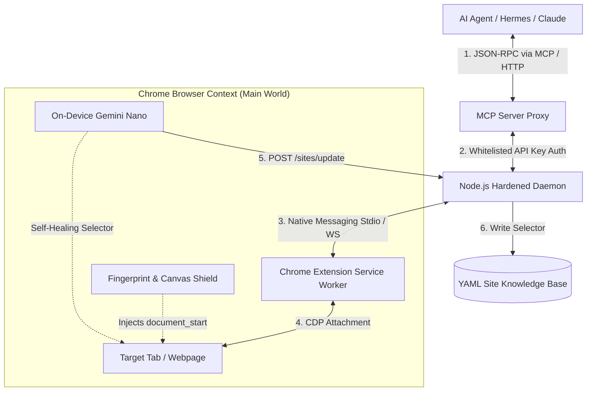

<div align="center">
  
  <br><br>
  
  <h1>⚡ GangNiaga WebBridge Pro v2.0 ⚡</h1>
  <p><strong>The Stealth, Sovereign, and Self-Healing OS-Level Browser Autopilot for AI Agents.</strong></p>

  <p>
    <a href="https://github.com/gangniagamy-cpu/GangNiaga-WebBridge/releases"></a>
    <a href="https://github.com/gangniagamy-cpu/GangNiaga-WebBridge/blob/main/LICENSE"></a>
    <a href="https://chrome.google.com/webstore/"></a>
    <a href="https://modelcontextprotocol.io/"></a>
  </p>

  <h4>"Bypass headless detection, slash API token costs, and automate web apps through your own logged-in Chrome session."</h4>
</div>

<hr />

## 🚀 What is WebBridge Pro?

**GangNiaga WebBridge Pro** is a lightweight, zero-click Native Messaging bridge that connects AI Agents (like Hermes, Claude Desktop, Cursor, and OpenClaw) directly into your active, authenticated Google Chrome profile.

Traditional frameworks (like Playwright, Puppeteer, or Selenium) spin up clean, automated browser profiles that are easily flagged and blocked by Cloudflare, Akamai, or Datadome. **WebBridge Pro is different.** It operates inside your actual residential Chrome session, sharing your logged-in cookies, visual canvas, residential IP, and genuine human mouse movement paths.

---

## 🏆 Why WebBridge is Undefeated (100k Star Matrix)

| Capabilities | ⚡ GangNiaga WebBridge Pro | 🎭 Playwright / Puppeteer | 🤖 Browser-Use (Python) | 👁️ Skyvern (Vision) |
| :--- | :--- | :--- | :--- | :--- |
| **Driver Engine** | **Chrome Debugger Protocol (CDP)** | Automated Browser Driver | Playwright Wrapper | Playwright Wrapper |
| **Profile Stealth** | **User's Authenticated Chrome** | Blank Automated Session | Blank Automated Session | Blank Automated Session |
| **Anti-Bot Bypass** | **Built-in Fingerprint & Canvas Noise** | Flagged by default | Flagged by default | Flagged by default |
| **AI Self-Healing** | **Yes (On-Device Gemini Nano)** | Yes (Requires Cloud LLM API) | No | Yes (Requires Cloud LLM API) |
| **Healing Persistence** | **Yes (Auto-saves back to YAML)** | No (Recalculates every run) | No | No |
| **Traversals** | **Recursive Shadow DOM Support** | Standard DOM query | Standard DOM query | Visual screenshot bounding |
| **Token Cost** | **Minimal (YAML Site Recipes)** | High (AXTree parsing) | Extremely High (DOM dumping) | Very High (VLM Screenshot) |
| **Setup Time** | **Instant (Self-registering daemon)** | Heavy installation scripts | Heavy Python dependencies | Heavy Docker setup |

---

## 🏗️ Architecture & Core Workflow



---

## 🌟 Killer Features

### 🛡️ 1. Cognitive Decoy & Fingerprint Shield
WebBridge injects a security defense script (`shield.js`) into the page's `MAIN` execution world at `document_start` before any page scripts load. It:
*   **Erases `navigator.webdriver`** to hide automated control.
*   **Spoofs `navigator.plugins` and languages** to match human setups.
*   **Randomizes Canvas & WebGL signatures** (injects minuscule, visual-neutral pixel noise) to break cross-site canvas fingerprint tracking.
*   **Cloaks WebGL Renderers** to report realistic NVIDIA/Intel desktop GPUs instead of generic headless engines.

### 🧠 2. Persistent On-Device AI Self-Healing
If a webpage layout changes and a selector (e.g., `#submit-btn`) fails to match, WebBridge automatically fetches a minimized accessibility tree and prompts **Chrome's built-in Gemini Nano model**.
*   **Offline inference:** Executes locally on user's hardware with `<150ms` latency.
*   **Closed-loop persistence:** Once Nano heals the selector, the extension reports the correction to the daemon, which updates the local YAML recipe file automatically. It never fails twice.

### 🧬 3. Recursive Shadow DOM Traversal
Modern single-page apps wrap interface elements inside closed/open Shadow DOM boundaries. WebBridge utilizes custom query selectors (`querySelectorDeep` and `queryAllElementsDeep`) to traverse shadow boundaries, enabling agents to select and automate elements that are invisible to standard scripts.

---

## 📂 Folder Structure

```bash
GangNiaga-WebBridge/
├── extension/          # Chrome Extension source (Load Unpacked here)
│   ├── shield.js       # Anti-bot fingerprint cloaking script
│   └── background.js   # Extension background worker (CDP execution engine)
├── daemon/             # Node.js Core Daemon (Port 10087)
│   ├── gangniaga-daemon.js # Whitelisted REST / WS routing bound to 127.0.0.1
│   ├── sites/          # Local YAML Site selector database (dynamic knowledge)
│   └── utils/          # Input sanitization and code execution validators
├── mcp-server/         # Model Context Protocol (MCP) server proxying 17 tools
├── docs/               # Detailed guides (Gemini Nano, configuration rules)
├── install.bat         # OS-Level Native Messaging Registry installer
└── setup-mcp.bat       # Auto-injects MCP configurations into AI clients
```

---

## 🛠️ Quick Start

### Step 1: Install the Extension
1. Open Google Chrome and go to `chrome://extensions/`.
2. Turn on **Developer mode** (top right).
3. Click **Load unpacked** (top left) and select the `extension/` directory of this repository.

### Step 2: Register Native Messaging (Windows)
1. Double-click `install.bat` in the root folder.
2. This configures the Windows Registry keys (`HKCU:\Software\Google\Chrome\NativeMessagingHosts\com.gangniaga.webbridge`) to let Chrome launch the Node daemon automatically.
3. Reload the extension in Chrome. The daemon will start in the background on port `10087` (binding securely to `127.0.0.1`).

### Step 3: Connect Your AI Client (via MCP)
If you are using Claude Desktop, Cursor, or Hermes-Agent:
1. Double-click `setup-mcp.bat`.
2. The script automatically registers the WebBridge Model Context Protocol server.
3. Restart your AI client. You will see **17 powerful new browser control tools** (e.g., `webbridge-navigate`, `webbridge-click`, `webbridge-snapshot`) available out of the box.

### Step 4: Install AI Skills (For Hermes-Agent & Gemini CLI)
If you are using **Hermes-Agent** or **Gemini CLI** to run autonomous agents:
1. Double-click `install-skills.bat`.
2. The script will automatically copy the WebBridge skills (`gangniaga-webbridge-pro`, `gangniaga-site-mapper`, `sovereign-ai-developer-pro`) to your active agent skills folders:
   * **Hermes-Agent** path: `%USERPROFILE%\.hermes\skills\`
   * **Gemini CLI** path: `%USERPROFILE%\.gemini\skills\`
3. Your local AI agents will instantly inherit A-Z browser control capabilities.

---

## 🔌 API & Integration Guide

### 1. REST Endpoint Authorization
All commands sent to the daemon require the API token generated in `daemon/.webbridge-auth.json` on startup:

```bash
# Headers:
# Authorization: Bearer <your_api_key>
# x-gangniaga-token: <your_api_key>
```

### 2. Action Whitelist Execution (POST `/command`)
Only secure, whitelisted commands can be executed:

```bash
curl -X POST http://127.0.0.1:10087/command \
  -H "Authorization: Bearer your_api_key" \
  -H "Content-Type: application/json" \
  -d '{
    "action": "navigate",
    "args": {
      "url": "https://facebook.com"
    }
  }'
```

### 3. Deep JavaScript Execution (POST `/command`)
Run isolated scripts inside the context of the page:

```bash
curl -X POST http://127.0.0.1:10087/command \
  -H "Authorization: Bearer your_api_key" \
  -H "Content-Type: application/json" \
  -d '{
    "action": "evaluate",
    "args": {
      "_tabId": 1234,
      "code": "document.querySelectorDeep(\"#shadow-host-button\").textContent"
    }
  }'
```

---

## 🛡️ License & Compliance
Built with ❤️.
This project operates under Sovereign AI Development Protocols. No bots were harmed in the making of this architecture.
Licensed under the [MIT License](LICENSE).
