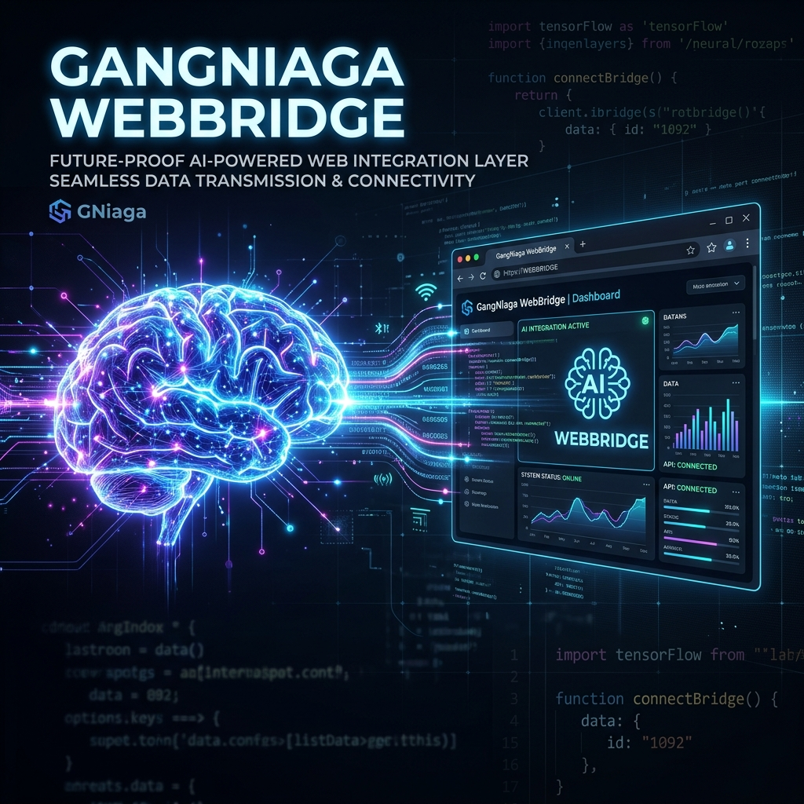
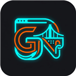
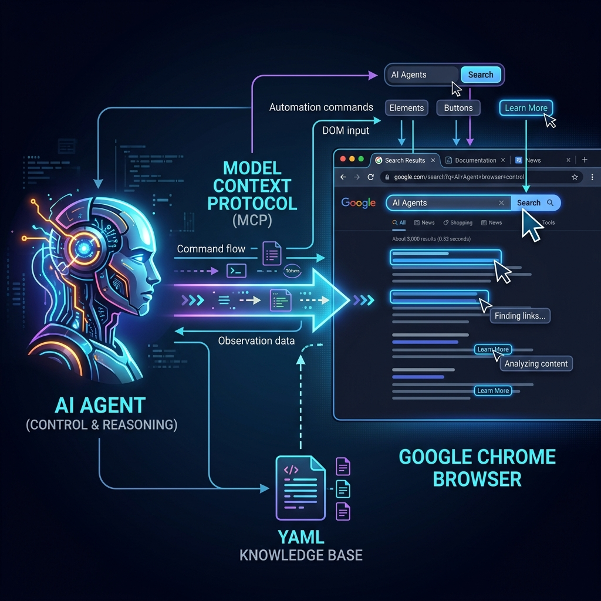
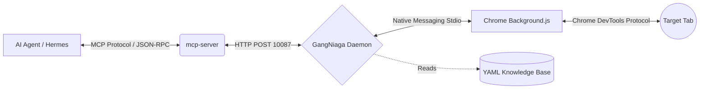

<div align="center">
  
  <br><br>
  
  <h1>GangNiaga WebBridge Pro</h1>
  <p><strong>The OS-Level Browser Automation Engine for LLMs & AI Agents.</strong></p>

  <p>
    <a href="https://github.com/gangniagamy-cpu/GangNiaga-WebBridge/releases"></a>
    <a href="https://github.com/gangniagamy-cpu/GangNiaga-WebBridge/blob/main/LICENSE"></a>
    <a href="https://chrome.google.com/webstore/"></a>
    <a href="https://modelcontextprotocol.io/"></a>
  </p>
</div>

<hr />

## 🚀 What is WebBridge?

**GangNiaga WebBridge** is an enterprise-grade, zero-click Native Messaging proxy that grants AI Agents (like Hermes, Claude Desktop, and Cursor) God-mode control over your existing Google Chrome browser.

Unlike Playwright or Selenium which spin up easily-detected headless browsers, WebBridge operates inside your *real* authenticated Chrome profile. 

### 💡 Why It's Undefeated:
*   ⚡ **Zero-Click Startup:** Daemon automatically spawns in the background via Chrome Native Messaging.
*   🧠 **YAML Site Knowledge (Anti-Hallucination):** Stop wasting API tokens dumping raw DOMs. Agents fetch precise CSS selectors instantly from local `.yaml` recipes.
*   🔀 **Parallel Tab Isolation:** Run 10 different AI agents simultaneously. Each agent gets a dedicated `_tabId` multiplexed through a single background worker. No cursor hijacking.
*   🔌 **Model Context Protocol (MCP):** Out-of-the-box MCP server integration for Claude and custom orchestrators.

---

## 🏗️ Architecture

<div align="center">
  
</div>



---

## 📦 Folder Structure

```bash
GangNiaga-WebBridge/
├── extension/          # The Chrome Extension source (Load Unpacked here)
├── daemon/             # The Node.js Core, Native hooks, and YAML Sites
├── mcp-server/         # Model Context Protocol (MCP) server for AI injection
├── skills/             # Brain scripts for AI Agents (Sovereign Protocols)
├── install.bat         # OS-Level Native Messaging Registry Installer
└── setup-mcp.bat       # Auto-injects MCP server into your AI config
```

---

## 🛠️ Quick Start

### 1. Install the Chrome Extension
1. Open Chrome and navigate to `chrome://extensions/`.
2. Enable **Developer mode**.
3. Click **Load unpacked** and select the `extension/` folder from this repo.

### 2. Activate Native Messaging (Windows)
1. Double click `install.bat` in the root folder.
2. This creates the necessary Windows Registry keys for Chrome to talk to the Node daemon.
3. Reload the extension in Chrome. The daemon is now running on Port `10087`!

### 3. Inject MCP into your AI (Optional)
If you use Claude Desktop or Hermes:
1. Double click `setup-mcp.bat`.
2. It will automatically detect your `claude_desktop_config.json` and inject the GangNiaga tools.

---

## 🤖 AI Provider Integrations

GangNiaga WebBridge is designed to be the ultimate translation layer between LLMs and your browser. Here is how to connect it to major AI ecosystems:

### 🦅 1. Official Hermes-Agent (Autonomous AI)
WebBridge natively supports the **Official Hermes-Agent** ecosystem for deep OS-level automation.
*   **Setup:** Hermes uses the `gangniaga-webbridge-pro` skill to connect seamlessly to the browser.
*   **Usage:** Once `install-skills.bat` is run, Hermes will automatically detect the WebBridge daemon on port `10087` and can be instructed in natural language (e.g. *"Hermes, open Canva and download my latest design"*). Hermes will query the local YAML database, acquire the `_tabId`, and silently automate the browser in the background.

### 🌐 2. OpenClaw (Remote Control)
OpenClaw is a gateway that allows external AI operators (or distributed LLM swarms) to command your local browser securely.
*   **Setup:** Point your OpenClaw relay agent to `http://127.0.0.1:10087`.
*   **Security:** Ensure that OpenClaw restricts destructive endpoints (like closing all tabs). OpenClaw translates global LLM commands into WebBridge Native Messaging JSON objects.

### 🖥️ 3. Claude Desktop / Cursor IDE (via MCP)
Anthropic's Model Context Protocol (MCP) allows IDEs to use tools directly.
*   **Setup:** Run `setup-mcp.bat`. This registers the Node.js MCP server located in `/mcp-server/index.js`.
*   **Usage:** In Claude Desktop, simply say: *"Check my email for the OTP code"*. Claude will invoke the `webbridge-navigate` and `webbridge-evaluate` MCP tools, which pipe through the daemon directly into Chrome.

### 🐍 4. Custom Python / LangChain Agents
If you are building your own agent using LangChain, OpenAI Operator, or AutoGPT:
*   Instead of importing Playwright, just make standard `requests.post()` calls to the Daemon API (see API Reference below).

---

## 📡 API Reference

If you are writing custom Python/Node scripts, you can talk to the browser via `http://127.0.0.1:10087`.

**1. Health Check**
```bash
curl -s http://127.0.0.1:10087/status
```

**2. Open Tab**
```bash
curl -X POST http://127.0.0.1:10087/command -d '{"action": "navigate", "args": {"url": "https://google.com"}}'
```

**3. Execute Isolated JavaScript (Requires `_tabId`)**
```bash
curl -X POST http://127.0.0.1:10087/command -H "Content-Type: application/json" -d '{
  "action": "evaluate",
  "args": {
    "_tabId": 12345,
    "code": "document.querySelector(\"textarea[name='q']\").value = \"Hello AI\";"
  }
}'
```

---

## 🛡️ License & Credit
Built with ❤️ by **GangNiaga**.
This project operates under Sovereign AI Development Protocols. No bots were harmed in the making of this architecture.
