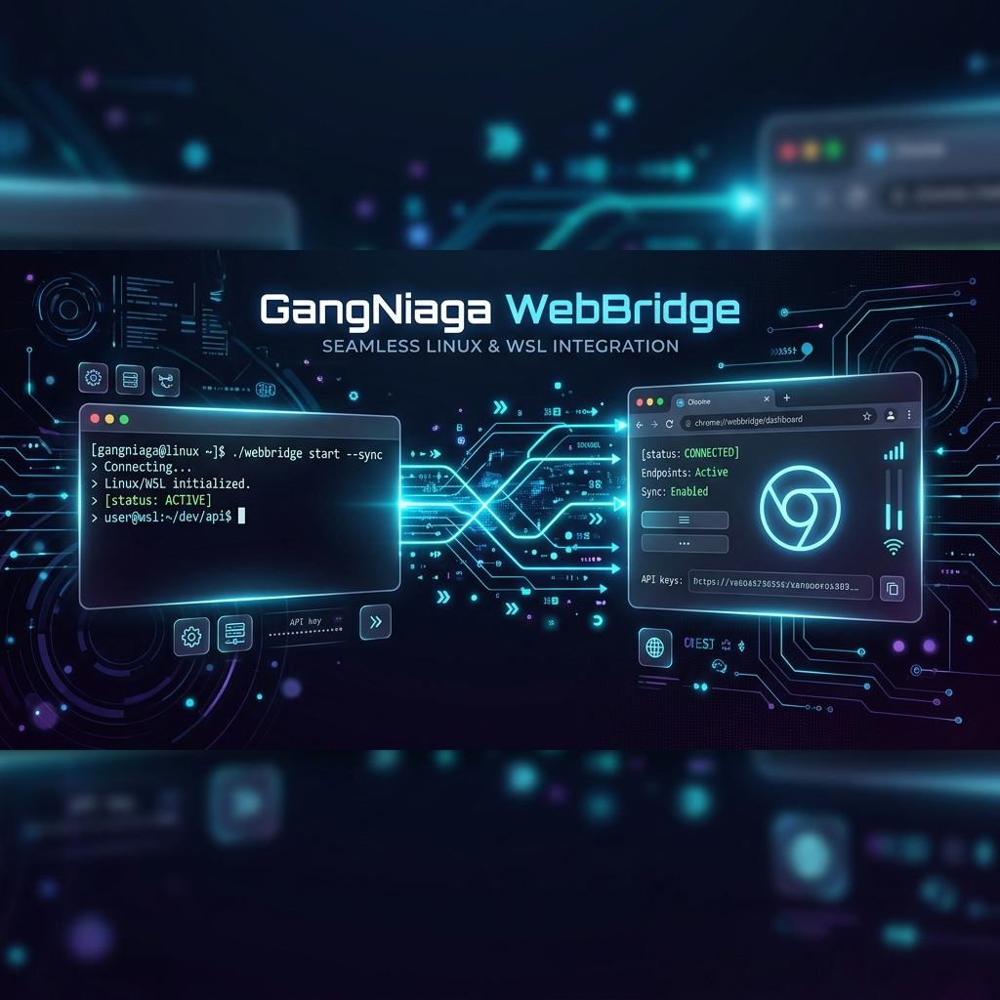
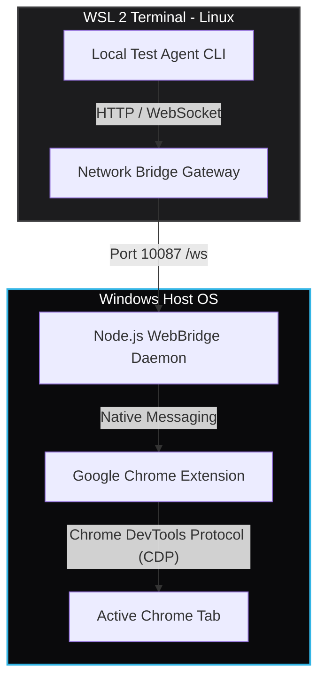

<div align="center">



# ⚡ GangNiaga WebBridge v2.5

### _The Sovereign Browser Control Bridge for Autonomous AI Agents_

[]()
[]()
[]()
[]()

**GangNiaga WebBridge** ialah jambatan automasi pelayar web berperisa perusahaan (_enterprise-grade_) yang menghubungkan ejen AI tempatan (seperti official Nous Research Hermes Agent, PUSPA-V4, Claude Desktop, Cursor) terus ke profil Google Chrome Windows anda yang aktif dan disahkan.

[**Panduan A-Z (Bahasa Melayu)**](docs/TUTORIAL_AZ.md) • [**Agent Integration Guide**](AGENTS.md) • [**API Reference**](skills/gangniaga-webbridge-pro/SKILL.md)

</div>

---

## ✨ Kenapa WebBridge 1000% Lebih Hebat?

- 👤 **Akses Sesi Aktif (No Relogin)**: Tiada lagi isu pengesahan 2FA/OTP atau sekatan kuki. Ejen AI memandu profil Chrome peribadi anda, menggunakan kuki dan sesi masuk sedia ada anda (Shopee, Facebook, Canva, dll.).
- 🛡️ **Anti-Bot Bypass Shield**: Melangkau pengesan bot agresif (Cloudflare, Distil, dll.) menggunakan simulasi pergerakan tetikus berbentuk lengkung koordinat manusia dan manipulasi input reaktif secara terus.
- 🐧 **Pautan Telus WSL-ke-Windows**: Ejen AI di dalam WSL Kali Linux/Ubuntu boleh mengesan IP Windows Host secara dinamik dan memandu Chrome dengan sifar kelewatan (_zero latency_).
- 🧠 **Self-Healing Selectors**: Enjin AI tempatan (menggunakan Gemini Nano terbina dalam Chrome) akan secara automatik membaiki klik sekiranya kelas CSS atau ID laman web berubah, dan menyimpan pembetulan terus ke pangkalan data YAML tempatan.

---

## 🗺️ Seni Bina Sistem (Architecture Flow)



---

## 🚀 Pemasangan Ekspres (3 Langkah Pantas)

### 1. Pasang Extension (Chrome)

1. Buka `chrome://extensions/` di Google Chrome.
2. Hidupkan **Developer mode** (butang kanan atas).
3. Klik **Load unpacked** (butang kiri atas).
4. Pilih folder: `D:\GangNiaga-WebBridge\extension`.

### 2. Daftar & Aktifkan Daemon (Windows)

Double-click fail berikut di dalam direktori projek untuk pendaftaran automatik:

1. Double-click `install.bat` (Mendaftarkan Registry Key Native Messaging Chrome).
2. Double-click `start.bat` (Memasang dependensi, membersihkan port, dan memulakan daemon).
   _Pastikan tetingkap daemon terus berjalan di latar belakang._

### 3. Jalankan dari WSL

Buka terminal WSL Kali/Ubuntu anda, jalankan setup sekali sahaja:

```bash
cd /mnt/d/GangNiaga-WebBridge
bash wsl-setup.sh
source ~/.bashrc

# Jalankan Ejen Automasi Ujian (hermes-agent-aku)
hermes-agent-aku
```

> [!IMPORTANT]
> Arahan pintasan (_alias_) ujian bagi WebBridge di WSL dinamakan sebagai `hermes-agent-aku` / `Hermes-Agent-Aku` untuk mengelakkan percanggahan (_clash_) dengan arahan rasmi **`hermes`** daripada Ejen Hermes Nous Research (seperti `hermes chat`, `hermes setup`).

---

## 🎮 Arahan Ejen Automasi (GangNiaga Console)

WebBridge dilengkapi dengan skrip ejen konsol interaktif untuk ujian pantas:

### 🕹️ Mod Interaktif (`hermes-agent-aku-i`)

Kawal browser anda secara langsung langkah-demi-langkah:

```bash
hermes-agent-aku-i
```

- **`sites`** : Papar laman web yang tersedia dalam Pangkalan Pengetahuan YAML.
- **`load <domain>`** : Muat pangkalan pengetahuan laman web (contoh: `load shopee.com.my`).
- **`run`** : Mulakan pelaksanaan langkah demi langkah ejen ke atas sasaran.
- **`screenshot`** : Ambil gambar skrin utama fizikal Windows anda.
- **`exit`** : Keluar daripada konsol interaktif.

### 🤖 Mod Automatik (`hermes-agent-aku`)

Jalankan simulasi penuh automasi carian Shopee dan semakan visual.

---

## 🛠️ Rujukan API Perintah Ejen (18 Command Suite)

Ejen AI boleh menghantar perintah JSON POST ke `http://localhost:10087/command` dengan Header `Authorization: Bearer <API_KEY>`:

| Kategori             | Arahan (`action`) | Contoh Parameter (`args`)                                    |
| :------------------- | :---------------- | :----------------------------------------------------------- |
| **Tab & Navigasi**   | `navigate`        | `{"url": "https://google.com", "newTab": true}`              |
|                      | `close_tab`       | `{"_tabId": 1234}`                                           |
|                      | `list_tabs`       | `{}`                                                         |
| **Interaksi Web**    | `click`           | `{"selector": "button#submit"}`                              |
|                      | `mouse_click`     | `{"selector": "div.btn-buy"}` _(Bypass Anti-Bot)_            |
|                      | `fill`            | `{"selector": "input#search", "value": "Laptop"}`            |
|                      | `hover`           | `{"selector": "@e1"}`                                        |
|                      | `scroll`          | `{"x": 0, "y": 500}`                                         |
|                      | `upload`          | `{"selector": "input[type=file]", "files": ["D:/file.png"]}` |
| **Kawalan OS**       | `os_screenshot`   | `{"path": "D:/screenshots/image.png"}`                       |
|                      | `os_click`        | `{"x": 500, "y": 600}`                                       |
|                      | `hotkey`          | `{"keys": ["alt", "tab"]}`                                   |
| **Pengambilan Data** | `snapshot`        | `{}` _(Mengembalikan AXTree)_                                |
|                      | `screenshot`      | `{"selector": "div#chart"}` _(Screenshot DOM)_               |
|                      | `evaluate`        | `{"code": "document.title"}`                                 |
|                      | `extract_text`    | `{}`                                                         |
| **Peranti Lanjutan** | `send_keys`       | `{"keys": "Control+A"}`                                      |
|                      | `network`         | `{"cmd": "start"}`                                           |
|                      | `cdp`             | `{"method": "Page.reload", "params": {}}`                    |

---

## 🆘 Penyelesaian Masalah Pantas

| Masalah                                | Penyelesaian                                                                                                                    |
| :------------------------------------- | :------------------------------------------------------------------------------------------------------------------------------ |
| **`... was unexpected at this time.`** | Selesai dipadam sepenuhnya pada versi 2.5. Gunakan `start.bat` yang terkini.                                                    |
| **WSL tidak dapat ping daemon**        | Jalankan `curl -s http://$(ip route show default \| awk '{print $3}'):10087/status` untuk mengesahkan sambungan rangkaian.      |
| **Extension Disconnected**             | Kebiasaan Chrome Manifest V3 menidurkan background script jika terbiar. Ia akan bangun automatik sebaik perintah baru diterima. |
| **Wrong API Key**                      | Semak kunci semasa di `daemon/.webbridge-auth.json` dan kemas kini `.env` anda.                                                 |
| **Port 10087 disekat**                 | Jalankan fail PowerShell pembasmi daemon: `powershell -File kill-daemons.ps1`.                                                  |

---

## 📂 Struktur Direktori

```
GangNiaga-WebBridge/
├── daemon/         # Pelayan Daemon Node.js & Pengkalan Pengetahuan YAML
├── extension/      # Chrome Extension (CDP Connection, Anti-bot Shield)
├── docs/           # Manual Visual & Panduan Lengkap A-Z (Bahasa Melayu)
├── skills/         # Definisi Arahan Ejen AI (Test Agent WSL & Windows)
├── mcp-server/     # Integrasi Server Model Context Protocol (MCP)
└── start.bat       # Setup & Pelancar Automatik Sistem
```

---

<div align="center">

_Dibina dengan penuh dedikasi oleh **GangNiaga AI Developer Team** untuk generasi automasi ejen AI masa hadapan._

</div>
