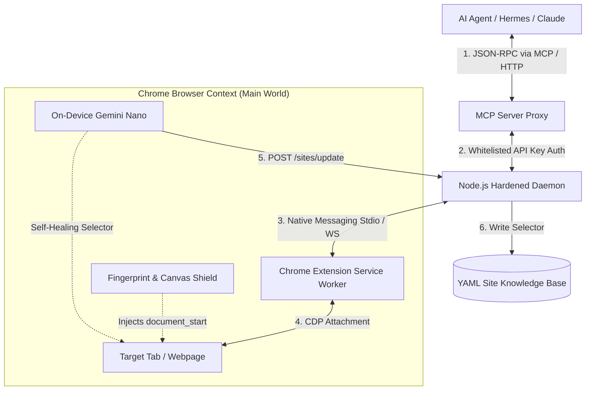

<div align="center">
  
  <br><br>
  
  <h1>⚡ GangNiaga WebBridge Pro v2.5.0 ⚡</h1>
  <p><strong>The Stealth, Sovereign, and Self-Healing OS-Level Browser Autopilot for AI Agents.</strong></p>

  <p>
    <a href="https://github.com/gangniagamy-cpu/GangNiaga-WebBridge/releases"></a>
    <a href="https://github.com/gangniagamy-cpu/GangNiaga-WebBridge/blob/main/LICENSE"></a>
    <a href="https://chrome.google.com/webstore/"></a>
    <a href="https://modelcontextprotocol.io/"></a>
  </p>

  <h4>"Bypass headless detection, slash API token costs, and automate web apps through your own logged-in Chrome session."</h4>
</div>

<hr />

## 📖 Table of Contents
- [🚀 What is WebBridge Pro?](#-what-is-webbridge-pro)
- [🏆 Why WebBridge is Undefeated](#-why-webbridge-is-undefeated)
- [🏗️ Architecture & Core Workflow](#️-architecture--core-workflow)
- [🌟 Killer Features](#-killer-features)
- [🖥️ Supported Environments](#️-supported-environments)
- [🛠️ Quick Start](#️-quick-start)
- [🔌 API & Integration Guide](#-api--integration-guide)
- [⚙️ Environment Configurations](#️-environment-configurations)
- [❓ Troubleshooting & FAQ](#-troubleshooting--faq)
- [🛡️ License & Compliance](#️-license--compliance)

---

## 🚀 What is WebBridge Pro?

**GangNiaga WebBridge Pro** is a lightweight, zero-click Native Messaging bridge that connects AI Agents (like Hermes, Claude Desktop, Cursor, and OpenClaw) directly into your active, authenticated Google Chrome profile.

Traditional frameworks (like Playwright, Puppeteer, or Selenium) spin up clean, automated browser profiles that are easily flagged and blocked by Cloudflare, Akamai, or Datadome. **WebBridge Pro is different.** It operates inside your actual residential Chrome session, sharing your logged-in cookies, visual canvas, residential IP, and genuine human mouse movement paths.

---

## 🏆 Why WebBridge is Undefeated

| Capabilities | ⚡ GangNiaga WebBridge Pro | 🎭 Playwright / Puppeteer | 🤖 Browser-Use (Python) | 👁️ Skyvern (Vision) |
| :--- | :--- | :--- | :--- | :--- |
| **Driver Engine** | **Chrome Debugger Protocol (CDP)** | Automated Browser Driver | Playwright Wrapper | Playwright Wrapper |
| **Profile Stealth** | **User's Authenticated Chrome** | Blank Automated Session | Blank Automated Session | Blank Automated Session |
| **Anti-Bot Bypass** | **Built-in Fingerprint & Canvas Noise** | Flagged by default | Flagged by default | Flagged by default |
| **AI Self-Healing** | **Yes (On-Device Gemini Nano)** | Yes (Requires Cloud LLM API) | No | Yes (Requires Cloud LLM API) |
| **Healing Persistence** | **Yes (Auto-saves back to YAML)** | No (Recalculates every run) | No | No |
| **Traversals** | **Recursive Shadow DOM Support** | Standard DOM query | Standard DOM query | Visual screenshot bounding |
| **Token Cost** | **Minimal (YAML Site Recipes)** | High (AXTree parsing) | Extremely High (DOM dumping) | Very High (VLM Screenshot) |
| **Setup Time** | **Instant (Self-registering daemon)** | Heavy installation scripts | Heavy Python dependencies | Heavy Docker setup |

---

## 🏗️ Architecture & Core Workflow



---

## 🌟 Killer Features

*   **🛡️ Cognitive Decoy & Fingerprint Shield**: Injects a security defense script (`shield.js`) into the page's execution context before any scripts load. Erases `navigator.webdriver`, spoofs plugins/languages, and randomizes Canvas & WebGL signatures.
*   **🧠 Persistent On-Device AI Self-Healing**: Automatically heals failed selectors on-device via **Chrome's built-in Gemini Nano model** ($<150ms$ latency) and persists rules back to local YAML recipes.
*   **🧬 Shadow DOM Traversal**: Built-in recursive deep queries (`querySelectorDeep`) to automatically traverse closed and open shadow boundaries.

---

## 🖥️ Supported Environments

| Operating Systems | Browsers Supported | Supported AI Clients |
| :--- | :--- | :--- |
| 🪟 Windows 10 / 11 | 🌐 Google Chrome | 🦅 Hermes-Agent (Python) |
| 🐧 WSL2 (Windows Subsystem for Linux) | 🧭 Chromium-based Browsers | 🖥️ Claude Desktop / Claude Code |
| | | 💻 Cursor IDE / OpenClaw |

---

## 🛠️ Quick Start

### Step 1: Install the Extension
1. Open Google Chrome and navigate to `chrome://extensions/`.
2. Turn on **Developer mode** (top right toggle).
3. Click **Load unpacked** (top left) and select the `extension/` directory of this repository.

### Step 2: Register Native Messaging (Windows)
1. Double-click `install.bat` in the root folder.
2. This configures the Windows Registry keys (`com.gangniaga.webbridge`) to let Chrome auto-bootstrap the Node daemon.
3. Reload the extension in Chrome. The daemon will start in the background on port `10087`.

### Step 3: Connect Your AI Client (via MCP)
If you are using Claude Desktop, Cursor, or Hermes-Agent:
1. Double-click `setup-mcp.bat`.
2. The script automatically registers the WebBridge Model Context Protocol (MCP) server.
3. Restart your client to expose the **18 browser control tools** (e.g. `browser_click`, `browser_snapshot`).

### Step 4: Install AI Skills (For Hermes-Agent & Gemini CLI)
1. Double-click `install-skills.bat`.
2. The script will automatically copy the WebBridge skills (`gangniaga-webbridge-pro`, `gangniaga-site-mapper`, `sovereign-ai-developer-pro`) to your active agent skills folders:
   * **Hermes-Agent** path: `%USERPROFILE%\.hermes\skills\`
   * **Gemini CLI** path: `%USERPROFILE%\.gemini\skills\`

---

## 🔌 API & Integration Guide

### 1. REST Endpoint Authorization
All commands sent to the daemon require the API token generated in `daemon/.webbridge-auth.json` on startup:
```http
Authorization: Bearer <your_api_key>
```

### 2. Integration Code Examples

<details>
<summary>🐍 Python (Hermes-Agent Integration)</summary>

```python
import requests

API_KEY = "wbr_your_generated_api_key"
HEADERS = {"Authorization": f"Bearer {API_KEY}"}

# 1. Navigate to page
payload = {
    "action": "navigate",
    "args": {"url": "https://google.com"}
}
res = requests.post("http://127.0.0.1:10087/command", json=payload, headers=HEADERS)
print(res.json())
```
</details>

<details>
<summary>🟢 Node.js (JavaScript Integration)</summary>

```javascript
const apiKey = "wbr_your_generated_api_key";

// 1. Fetch simplified AXTree snapshot
const response = await fetch("http://127.0.0.1:10087/command", {
  method: "POST",
  headers: {
    "Authorization": `Bearer ${apiKey}`,
    "Content-Type": "application/json"
  },
  body: JSON.stringify({
    action: "snapshot",
    args: {}
  })
});
const data = await response.json();
console.log(data);
```
</details>

---

## ⚙️ Environment Configurations

You can configure the WebBridge daemon behavior using a local `.env` file in the `daemon/` directory or system environment variables:

| Environment Variable | Type | Default | Description |
| :--- | :--- | :--- | :--- |
| `GANGNIAGA_API_KEY` | String | *Auto-generated* | Secret Bearer key to secure HTTP & WebSocket endpoints. |
| `GANGNIAGA_TIMEOUT_MS` | Integer | `30000` (30s) | Global timeout limit for browser CDP executions. |
| `GANGNIAGA_SECRET` | String | `null` | Secret key used to encrypt WebSocket payloads in AES-256-GCM. |

---

## ❓ Troubleshooting & FAQ

<details>
<summary>🔌 <b>Error: Connection failed — check address, network, and that the daemon is running</b></summary>
Ensure that your settings WebSocket URL is set exactly to: <code>ws://127.0.0.1:10087/ws</code>. If you are using port 10086 or another port by mistake, click <b>"Reset to default"</b> in the settings panel and click Save.
</details>

<details>
<summary>🪟 <b>How do I kill a hung background daemon process?</b></summary>
Run the provided PowerShell script in the root directory to safely terminate all WebBridge node instances without affecting your other Node.js apps:
<pre>powershell -File kill-daemons.ps1</pre>
</details>

<details>
<summary>🛡️ <b>Chrome says "Native messaging host not found" or extension is disconnected</b></summary>
Rerun the registry script <code>install.bat</code>. This registers the local manifest path in Windows Registry (HKCU) so Chrome knows how to locate and launch the Node.js daemon.
</details>

---

## 🛡️ License & Compliance
Built with ❤️.  
This project operates under Sovereign AI Development Protocols. No bots were harmed in the making of this architecture.  
Licensed under the [MIT License](LICENSE).
