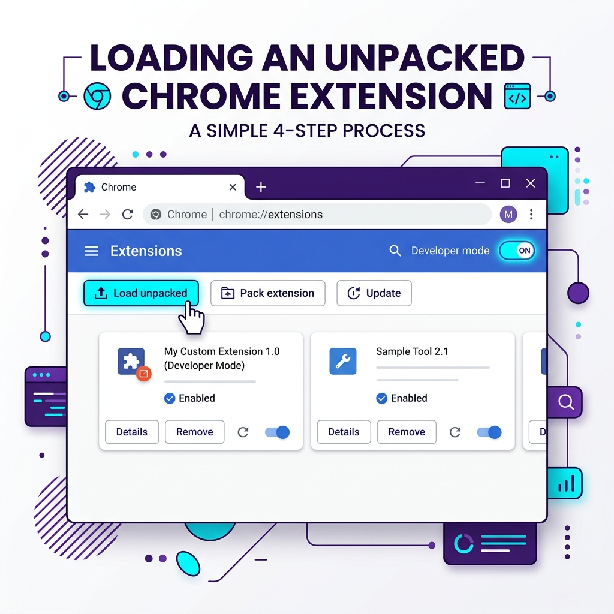
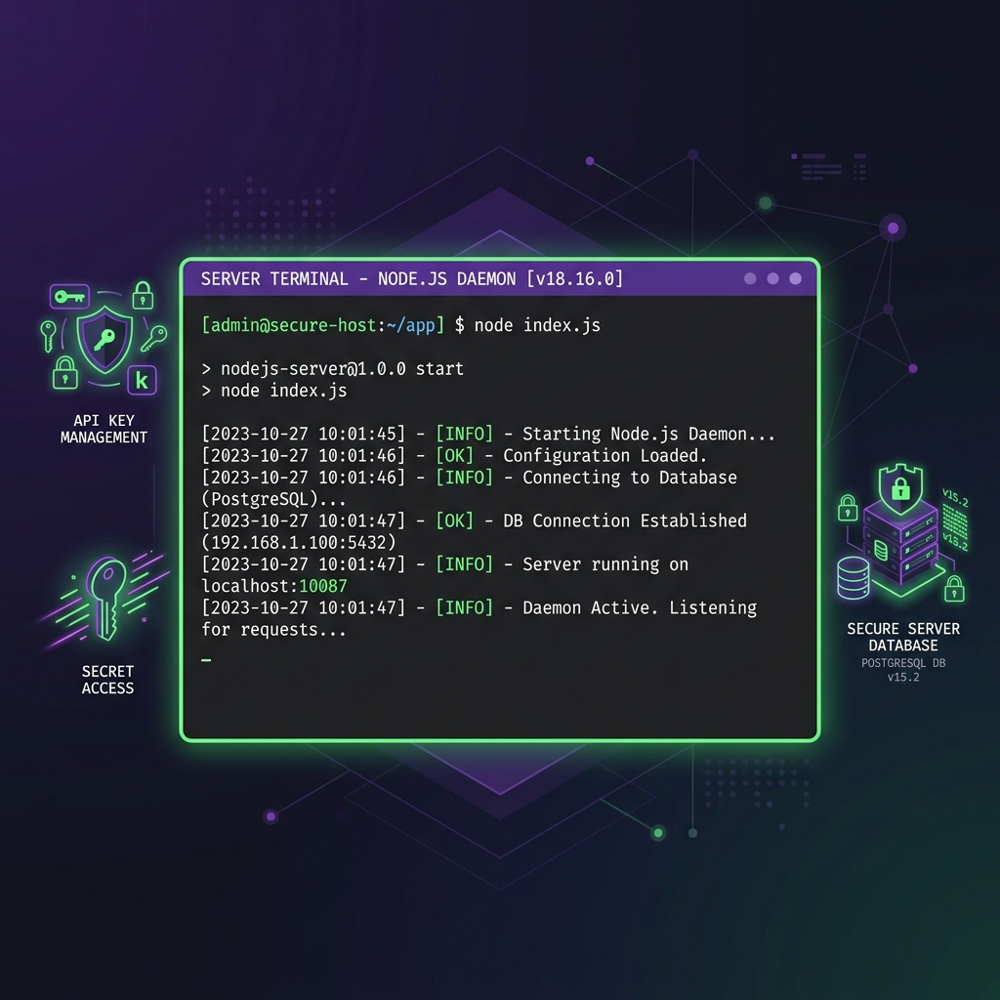
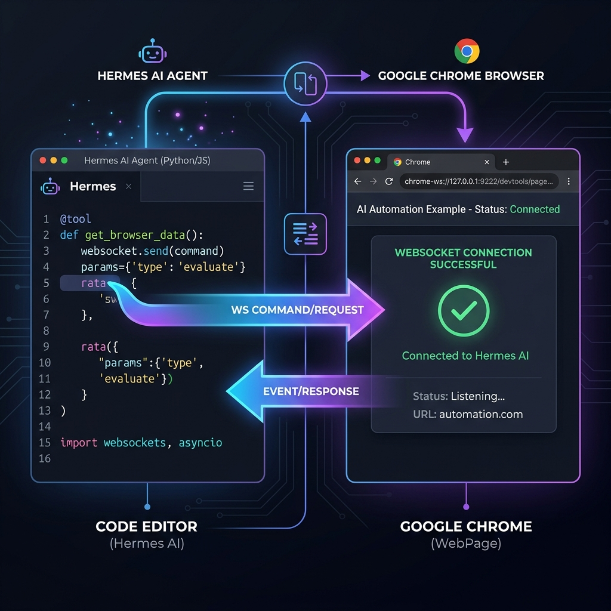

# ⚡ GangNiaga WebBridge Pro — Visual Setup Tutorial

Welcome to the visual installation guide. Follow these three simple steps to connect your browser context to your local AI Agent loop.

---

## 🧭 Step 1: Chrome Extension Setup

To allow the bridge to capture your authenticated session, cookies, and window canvas, load the unpacked extension in Google Chrome.

1. Open **Google Chrome** and navigate to: `chrome://extensions/`.
2. Enable **Developer mode** by toggling the switch in the top-right corner.
3. Click the **Load unpacked** button in the top-left corner.
4. Select the `D:\GangNiaga-WebBridge\extension` directory of this repository.

### 🖼️ Step 1 Visual Walkthrough



---

## ⚡ Step 2: Daemon Activation & Windows Registry Registration

The Native Messaging Host lets Chrome launch the Node.js daemon automatically. It binds to `127.0.0.1:10087` for secure local control.

1. Double-click the **`install.bat`** file in the repository root directory. This configures the Windows Registry keys (`HKCU:\Software\Google\Chrome\NativeMessagingHosts\com.gangniaga.webbridge`).
2. Reload the extension in your `chrome://extensions/` page to verify connection status.
3. If running a standalone server, start it manually by running:
   ```bash
   node daemon/gangniaga-daemon.js
   ```

### 🖼️ Step 2 Visual Walkthrough



---

## 🦅 Step 3: Connect Your AI Agent (Hermes / Claude / Cursor)

Expose the WebBridge commands to your local AI Agent or Claude Desktop client using the Model Context Protocol (MCP) server.

1. Double-click **`setup-mcp.bat`** to register the MCP server proxy automatically.
2. If using Python (Hermes-Agent), run the provided `install-skills.bat` to copy the skill files to your local agent skills folder (`%USERPROFILE%\.hermes\skills\`).
3. Launch your AI client. The agent will automatically detect the **18 browser control tools** and start piloting your browser.

### 🖼️ Step 3 Visual Walkthrough


