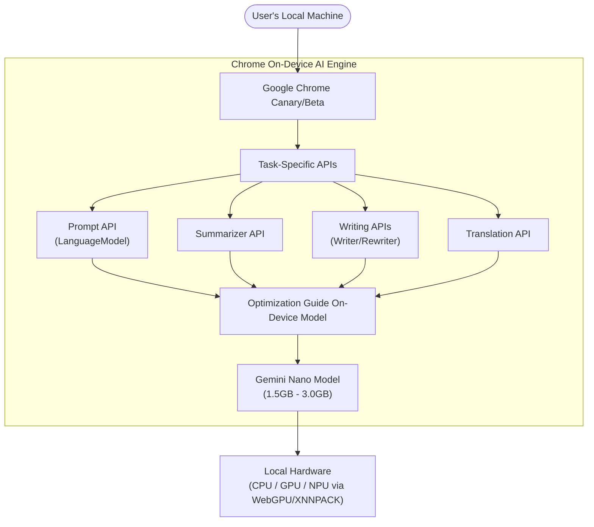

# 🧠 Google Chrome Built-in AI (Gemini Nano) Research Report

This document compiles the latest technical specifications, capabilities, namespaces, implementation patterns, and automation strategies for Google Chrome's native, on-device AI engine powered by **Gemini Nano**.

---

## 🧭 1. Executive Summary & Architecture

Google Chrome embeds a local, lightweight instance of the **Gemini Nano** model directly into the browser. This enables developers to execute LLM inference locally on the user's hardware (utilizing CPU, GPU, or NPUs), opening up new paradigms for web application development.

### Core Architectural Benefits:

- **Zero Server Costs:** Completely eliminates API token billing and cloud server infrastructure costs.
- **Absolute Privacy:** Sensitive inputs are processed entirely on-device, satisfying strict security and compliance requirements.
- **Minimal Latency:** Bypasses network round-trip times, enabling instantaneous interaction suitable for real-time automation.
- **Offline Availability:** AI capabilities persist even when the user is disconnected from the internet.



---

## 🛠️ 2. Dev Setup & Configuration Prerequisites

Built-in AI APIs are experimental and hidden behind Chromium feature flags. To run them, execute the following steps:

### A. System Requirements

- **Chrome Version:** Chrome 127 or later (Chrome Canary or Beta is highly recommended).
- **Storage:** At least **4 GB** of free disk space (the model requires ~1.5 GB to 3.0 GB depending on the platform).
- **Hardware:** A modern GPU or NPU is recommended, though CPU fallback using XNNPACK is supported.

### B. Configuring Flags (`chrome://flags`)

Enable the following flags by pasting their paths in the Chrome address bar:

1.  `chrome://flags/#prompt-api-for-gemini-nano` ➔ Set to **Enabled**.
2.  `chrome://flags/#optimization-guide-on-device-model` ➔ Set to **Enabled BypassPrefRequirement** (forces Chrome to download the model ignoring local benchmark results).
3.  `chrome://flags/#summarization-api-for-gemini-nano` (or `#summarizer-api-for-gemini-nano`) ➔ Set to **Enabled** if visible. Note: In newer Chrome versions (v138+ / v148+), this flag might be missing because the Summarizer API is **enabled by default** in stable releases.
4.  `chrome://flags/#writer-api-for-gemini-nano` & `#rewriter-api-for-gemini-nano` ➔ Set to **Enabled** (if using writing assistants).
5.  Restart Chrome fully.

### C. Triggering & Monitoring Model Download (`chrome://components`)

1.  Navigate to `chrome://components`.
2.  Locate **Optimization Guide On Device Model**.
3.  Click **Check for update**.
4.  The browser will start downloading the model. You can track this in `chrome://on-device-internals`. Do not close Chrome until the status is **Up-to-date** or **Component updated**.

---

## 🔌 3. The Chrome Built-in AI API Suite (2026 Status)

Google has deprecated the early generic `window.ai` namespace in favor of **specialized, task-based sub-objects** to optimize model parameters, restrict context windows, and manage system resources efficiently.

| API Class / Namespace     | Standard Property          | API Status               | Use Case                                                  |
| :------------------------ | :------------------------- | :----------------------- | :-------------------------------------------------------- |
| **Prompt API**            | `ai.languageModel`         | **Stable** (Chrome 148+) | General natural language chat, reasoning, classification. |
| **Summarizer API**        | `ai.summarizer`            | **Stable** (Chrome 148+) | High-efficiency document/text summarization.              |
| **Translator API**        | `self.translation`         | **Stable** (Chrome 148+) | Multi-language translation without cloud latency.         |
| **Language Detector API** | `self.ai.languageDetector` | **Stable** (Chrome 148+) | Automatic language detection on client side.              |
| **Writer API**            | `ai.writer`                | **Origin Trial**         | Creating drafts, expanding notes, writing templates.      |
| **Rewriter API**          | `ai.rewriter`              | **Origin Trial**         | Modifying tone, length, or styling of text.               |
| **Proofreader API**       | `ai.proofreader`           | **Origin Trial**         | Grammar correction and spelling checker.                  |

> [!WARNING]
> **Namespace Deprecation Warning:** If you are migrating older extensions or scripts that use `window.ai.create()`, you **must** rewrite them. Chrome now enforces separation of concerns (e.g. `ai.languageModel` for prompts, `translation` for translations).

---

## 💻 4. JavaScript Core Implementation Patterns

### A. The Prompt API (Standard & Streaming)

Use `ai.languageModel.capabilities()` to inspect model availability before initializing the session. Always call `.destroy()` when done to prevent GPU/NPU memory leaks.

```javascript
async function executeOnDevicePrompt(systemPrompt, userPrompt, onChunk = null) {
  // 1. Check if the AI interface and LanguageModel exist
  if (typeof ai === 'undefined' || !ai.languageModel) {
    throw new Error('Prompt API is not supported in this browser.');
  }

  // 2. Validate capabilities
  const capabilities = await ai.languageModel.capabilities();
  if (capabilities.available === 'no') {
    throw new Error('Gemini Nano is not supported on this device.');
  }

  if (capabilities.available === 'after-download') {
    console.warn('Model needs to be downloaded first. Download is triggered automatically.');
    return null;
  }

  // 3. Create session with custom parameters
  const session = await ai.languageModel.create({
    systemPrompt: systemPrompt,
    temperature: 0.6, // Default is 0.8, range 0.0 - 2.0
    topK: 3, // Default is 3, controls diversity
  });

  try {
    if (onChunk && typeof onChunk === 'function') {
      // 4a. Streaming Mode
      const stream = session.promptStreaming(userPrompt);
      let fullResponse = '';
      for await (const chunk of stream) {
        fullResponse = chunk; // In Chrome, chunk contains the accumulated text so far!
        onChunk(chunk);
      }
      return fullResponse.trim();
    } else {
      // 4b. Standard Mode
      const response = await session.prompt(userPrompt);
      return response.trim();
    }
  } catch (err) {
    console.error('[Gemini Nano] Prompt failed:', err);
    throw err;
  } finally {
    // 5. Critical: Destroy session to reclaim system memory
    session.destroy();
  }
}
```

### B. Summarizer API

The Summarizer API is optimized to digest large texts. You can request paragraphs, headlines, or bullet points.

```javascript
async function summarizeText(longText) {
  if (typeof ai === 'undefined' || !ai.summarizer) {
    throw new Error('Summarizer API is not supported.');
  }

  const capabilities = await ai.summarizer.capabilities();
  if (capabilities.available === 'no') return 'Summarizer unavailable';

  const summarizer = await ai.summarizer.create({
    type: 'key-points', // 'tl;dr', 'key-points', 'teaser', 'headline'
    format: 'markdown', // 'plain-text', 'markdown'
    length: 'medium', // 'short', 'medium', 'long'
  });

  try {
    const summary = await summarizer.summarize(longText, {
      context: 'Summarize for a busy executive.',
    });
    return summary;
  } finally {
    summarizer.destroy();
  }
}
```

### C. Writer & Rewriter APIs

Perfect for client-side editorial features, tone adjustment, or form autofill completion.

```javascript
// 1. Writer API (Generate text from scratch)
async function generateDraft(promptText) {
  if (typeof ai === 'undefined' || !ai.writer) return null;

  const writer = await ai.writer.create({
    sharedContext: 'You are an e-commerce assistant writing polite follow-up emails.',
  });

  try {
    return await writer.write(promptText);
  } finally {
    writer.destroy();
  }
}

// 2. Rewriter API (Modify existing text)
async function adjustTone(originalText, targetTone) {
  if (typeof ai === 'undefined' || !ai.rewriter) return null;

  const rewriter = await ai.rewriter.create({
    sharedContext: `Rewrite the user input to sound ${targetTone}.`,
    tone: targetTone,
    length: 'short',
  });

  try {
    return await rewriter.rewrite(originalText);
  } finally {
    rewriter.destroy();
  }
}
```

### D. Translation API

Unlike cloud translators, the on-device `translation` API translates text locally without network roundtrips.

```javascript
async function translateLocally(text, fromLang, toLang) {
  if (typeof translation === 'undefined') {
    throw new Error('Local Translation API is not supported.');
  }

  const availability = await translation.canTranslate({
    sourceLanguage: fromLang,
    targetLanguage: toLang,
  });

  if (availability === 'no') {
    throw new Error(`Translation from ${fromLang} to ${toLang} is not supported.`);
  }

  const translator = await translation.create({
    sourceLanguage: fromLang,
    targetLanguage: toLang,
    monitor(m) {
      m.addEventListener('downloadprogress', (e) => {
        console.log(`Downloading language pack: ${Math.round((e.loaded / e.total) * 100)}%`);
      });
    },
  });

  try {
    return await translator.translate(text);
  } finally {
    translator.destroy();
  }
}
```

---

## 🔍 5. Troubleshooting & Debugging

### A. The Optimization Guide Component fails to download

- **Cause:** Your system has less than 22% battery power (on laptops), or disk space is low.
- **Fix:** Connect your laptop to a charger, clear disk space, and relaunch Chrome. You can force bypass checks by using the `BypassPerfRequirement` flag.

### B. Chromium Bug 392661409 (Object Serialization Failure)

- **Symptom:** Passing structured objects to `session.prompt()` causes errors or returns `[object Object]` as input to Gemini.
- **Fix:** Ensure prompt inputs are strictly passed as flat strings. If you need structured data, stringify the input into JSON format before sending:
  ```javascript
  const promptString = JSON.stringify({ query: "find input", elements: [...] });
  const response = await session.prompt(promptString);
  ```

### C. `chrome://on-device-internals`

This hidden URL is your primary terminal for on-device AI debugging.

- **Event Logs:** Check the exact prompt text sent to the model (including system prompts).
- **Model Information:** Displays the loaded model version, path, and cache size.
- **Performance Metrics:** Shows time-to-first-token, token-per-second generation rates, and memory footprint.

---

## 🚀 6. Integration Strategy for Browser Autopilot (WebBridge)

Browser automation agents (like `GangNiaga-WebBridge` and `OpenClaw`) can leverage on-device Gemini Nano to build **highly resilient, autonomous navigation engines**:

### 1. Self-Healing Selectors

When a selector in a static recipe fails (e.g., a button class was changed by React/Vite compilation), the extension can extract a minimized representation of the local DOM (or interactive AXTree) and prompt Gemini Nano to identify the new selector. This healing is done offline in `<150ms`.

### 2. Form Filling & Reasoning

On-device models can evaluate input fields dynamically to figure out what values to insert (e.g., detecting if a field demands a "First Name", "ZIP Code", or "Business Registration ID") without querying an external API.

### 3. Interactive Web Scraping

Instead of piping full HTML pages back to a centralized cloud LLM, the extension can perform local summarization or entity extraction using `ai.summarizer` on the page itself, returning only the parsed results. This reduces network payload by **99%**.
