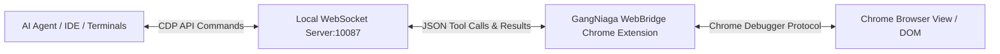

# 🔌 GangNiaga WebBridge — AI Agent Integrations & Providers

Dokumen ini menyediakan panduan konfigurasi dan integrasi untuk menyambungkan **GangNiaga WebBridge** Chrome Extension ke pelbagai penyedia AI Agent utama di pasaran, termasuk **OpenClaw**, **Hermes-Agent**, **Claude Code**, dan skrip ejen tersuai (Custom Scripts).

---

## 🏛️ Reka Bina Sambungan (Architecture)

GangNiaga WebBridge beroperasi sebagai **WebSocket Client** yang menyambung secara automatik ke pelayan daemon tempatan (atau remote relay) yang berjalan pada alamat:
`ws://127.0.0.1:10087/ws`



---

## 🚀 Senarai Panduan Integrasi (Click to View)

Kami menyediakan fail konfigurasi, kod pelayan daemon (mock-server), dan contoh sistem prompt bagi setiap provider:

1. 🌐 **[OpenClaw Integration Guide](file:///D:/GangNiaga-WebBridge/integrations/openclaw.md)**: Cara menyambungkan OpenClaw Gateway (`operator.gangniaga.my`) dan ejen PUSPA-V4.
2. 🦅 **[Hermes Agent Integration Guide](file:///D:/GangNiaga-WebBridge/integrations/hermes_agent.md)**: Panduan integrasi penuh bersama Hermes Agent dan skrip Python/Node.js tersuai.
3. 🤖 **[Claude Code & IDEs Guide](file:///D:/GangNiaga-WebBridge/integrations/claude_code.md)**: Menyambungkan Claude Code CLI, Cursor, dan Codex secara langsung menggunakan WebSocket relay.

---

## 🛠️ Kod Daemon WebSocket Asas (Quickstart Daemon)

Jika anda membina AI Agent anda sendiri (e.g. guna LangChain, CrewAI, atau Autogen), anda boleh menggunakan skrip Node.js di bawah sebagai **Daemon Server** yang mendengar pada port `10087`:

```javascript
// daemon.js
const { WebSocketServer } = require('ws');
const wss = new WebSocketServer({ port: 10087, path: '/ws' });

console.log('GangNiaga WebBridge Daemon running on ws://127.0.0.1:10087/ws');

wss.on('connection', ws => {
  console.log('Chrome Extension connected successfully!');
  
  // Contoh menghantar tool_call untuk melayari laman web shopee
  setTimeout(() => {
    console.log('Sending navigate command...');
    ws.send(JSON.stringify({
      type: 'tool_call',
      requestId: 'req-navigate-1',
      payload: {
        name: 'navigate',
        args: { url: 'https://shopee.com.my' }
      }
    }));
  }, 2000);

  ws.on('message', message => {
    const data = JSON.parse(message.toString());
    console.log('Received from Extension:', JSON.stringify(data, null, 2));
  });
});
```

Sila laksanakan arahan `npm install ws` sebelum menjalankan skrip di atas.
